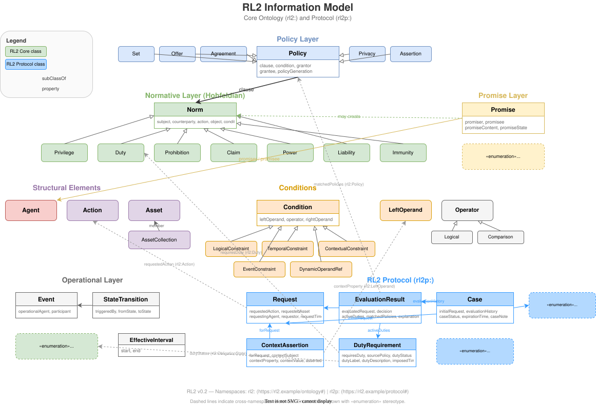

## Table of Contents

- Introduction
- Design Principles
- Conceptual Model
- Normative Files
- Ontology Overview
  - Normative Layer (DPCL)
  - Promise Theory Layer
  - Agents and Roles
  - Actions, Assets, and Conditions
  - Operational Layer
  - Temporal Constructs
  - Policy Containers
  - Policy Generations
- SHACL Validation
- Example Policy
- Role System
- RL2 Information Model
- References

---

## Introduction

RL2 ("Rights Language 2") is a next-generation policy language designed as a standalone successor to existing rights languages. It provides a **strict superset** of capabilities found in:

* **ODRL 2.2** (W3C Recommendation)
* **DPCL** (Normative specification meta-language)
* **Promise Theory** (Burgess & Røstad)
* **ODRE** (Operational semantics for digital rights enforcement)

RL2 aims to unify:

* **descriptive policies** (permissions, prohibitions, duties)
* **normative relations** (powers, claims, liabilities, promises)
* **multi-party workflows** (approvals, internal obligations)
* **operational behavior** (events, triggers, state transitions)
* **temporal constraints** (validity intervals, sequences)
* **RDF/OWL + SHACL syntax and validation**
* **formal semantics** suitable for deterministic evaluation by a verified runtime kernel

Unlike prior standards, RL2 has **precise semantics**, **clean role modeling**, and **formal operational rules**, while still being **100% RDF-native** and **machine-interpretable**. It is designed to be a compilation target for ODRL 2.2, meaning legacy policies can be losslessly translated into RL2 for unambiguous execution.

---

## Design Principles

RL2 follows these design principles:

### Standalone & Self-Contained

RL2 does not import or depend on external ODRL definitions. It defines all necessary constructs natively to ensure semantic stability and version control.

### Normative Completeness

RL2 incorporates the Hohfeldian normative distinctions as subclasses of `Norm`:

* Privilege (correlative: No-Claim)
* Duty (correlative: Claim)
* Claim (correlative: Duty)
* Power (correlative: Liability)
* Liability (correlative: Power)
* Immunity (correlative: Disability)

Additionally, RL2 defines `Prohibition` as a distinct subclass for practical convenience—Hohfeld would model this as a Duty to refrain, but explicit prohibition simplifies policy authoring.

Note: The correlatives No-Claim and Disability are not modeled as explicit classes in RL2; they represent the *absence* of a normative position rather than a position itself.

### Voluntary Cooperation

Based on Promise Theory:

* Promises are voluntary commitments between agents,
* Not simply duties.

### Clear Role Semantics

Normative roles (subject, counterparty, promisor, promisee)
are distinct from syntactic/functional roles (grantor, approver, operator).

### Operational Semantics

RL2 policies have **stateful behavior**.
This is where ODRE concepts enter:

* Events
* Obligation states
* State transitions
* Sequential workflows

### RDF-native, SHACL-validated

The RL2 ontology is fully RDF/OWL, with a SHACL grammar defining:

* structural constraints
* cardinality requirements
* typing rules
* role consistency rules

### Mechanization-Ready

RL2 is designed for formal verification. The semantics map directly to:
- **Why3**: Algebraic datatypes, pure functions, inductive predicates
- **K Framework**: Rewrite-based executable semantics
- **Lean 4 / Coq**: Dependent types, tactic proofs, code extraction

See **RL2_ResearchPlan.md** for the mechanization roadmap.

---

## Conceptual Model

RL2 consists of **eight layers**:

1. **Normative Layer** — Fundamental legal/moral categories (Hohfeldian relations)
2. **Promise Theory Layer** — Voluntary cooperation commitments
3. **Role Layer** — Roles of agents in normative or syntactic structures
4. **Action/Asset/Condition Layer** — Core structural elements
5. **Operational Layer** — Events, triggers, state transitions
6. **Temporal/Context Layer** — Time windows, dynamic references, contextual constraints
7. **Policy Container Layer** — Bundles normative clauses into policies
8. **Policy Generation Layer** — Versioning and immutable policy universes

---

## Normative Files

The RL2 ontology and validation shapes are defined in separate, machine-readable files:

| File | Description |
|------|-------------|
| **[rl2.ttl](rl2.ttl)** | Complete RL2 OWL ontology in Turtle format |
| **[rl2-shacl.ttl](rl2-shacl.ttl)** | SHACL shapes for syntax validation |

These files are normative. The sections below provide explanatory prose and representative excerpts.

### Alignment Modules

*This subsection is non-normative.*

RL2 Core is standalone and does not import external ontologies. However, optional alignment modules may provide `owl:equivalentClass` and `rdfs:subClassOf` mappings to standard vocabularies such as PROV-O, OWL-Time, and FOAF. See **RL2_DiscussionTopics.md §1** for discussion of alignment strategies.

---

## Ontology Overview

The RL2 namespace is `https://rl2.example/ontology#` (prefix `rl2:`).

### Normative Layer (DPCL)

The normative layer defines Hohfeldian legal relations as OWL classes:

```turtle
rl2:Norm a owl:Class ;
    rdfs:comment "A normative relation in the DPCL sense." .

rl2:Privilege rdfs:subClassOf rl2:Norm .
rl2:Duty rdfs:subClassOf rl2:Norm .
rl2:Prohibition rdfs:subClassOf rl2:Norm .
rl2:Claim rdfs:subClassOf rl2:Norm .
rl2:Power rdfs:subClassOf rl2:Norm .
rl2:Liability rdfs:subClassOf rl2:Norm .
rl2:Immunity rdfs:subClassOf rl2:Norm .
```

**Hohfeldian Correlatives**:

Hohfeld identified eight fundamental legal concepts arranged in four correlative pairs. When one party holds a position, the other party necessarily holds its correlative:

| Position | Correlative | Relationship |
|----------|-------------|--------------|
| Privilege | No-Claim | If A has a privilege to φ, B has no claim that A not φ |
| Claim | Duty | If A has a claim that B φ, B has a duty to φ |
| Power | Liability | If A has power to change B's position, B is liable to that change |
| Immunity | Disability | If A is immune from B's power, B is disabled from exercising it |

**RL2 Modeling Decisions**:

1. **No-Claim and Disability are not explicit classes.** These represent the *absence* of a normative position rather than a position itself. A No-Claim is simply the lack of a Claim; a Disability is the lack of a Power. Modeling absences as classes would be ontologically awkward and computationally unnecessary—we can infer them from the absence of the corresponding positive position.

2. **Prohibition is an RL2 addition.** In strict Hohfeldian terms, a prohibition is a Duty to refrain from an action, with a correlative Claim that the action not be performed. RL2 models Prohibition as a distinct subclass for practical reasons:
   - Policy authors think in terms of "you may not do X" rather than "you have a duty to not do X"
   - It allows `rl2:prohibitedAction` as a dedicated property, avoiding awkward negation constructs
   - ODRL and similar languages treat prohibition as a first-class concept; this eases translation

Properties like `rl2:correlativeTo`, `rl2:affectsNorm`, `rl2:exposedTo`, and `rl2:immuneFrom` capture relationships between correlative positions. Valid `correlativeTo` pairings are: Duty ↔ Claim, Power ↔ Liability, Immunity ↔ Disability.

### Promise Theory Layer

Promises model voluntary commitments between agents:

```turtle
rl2:Promise a owl:Class ;
    rdfs:comment "Voluntary cooperative commitment from promisor to promisee." .

rl2:promisor rdfs:domain rl2:Promise ; rdfs:range rl2:Agent .
rl2:promisee rdfs:domain rl2:Promise ; rdfs:range rl2:Agent .
rl2:promiseContent rdfs:domain rl2:Promise ; rdfs:range rl2:PromiseContent .
```

Promise content may be an Action, Duty, or Condition. Promises have states: `PromisePending`, `PromiseFulfilled`, `PromiseViolated`.

#### Why Promises Are Distinct from Norms

RL2 deliberately separates `Promise` from `Norm` (and its subclasses like `Duty`). This distinction reflects a fundamental conceptual difference:

| Aspect | Norm | Promise |
|--------|------|---------|
| **Source** | Imposed by policy or authority | Voluntary commitment by an agent |
| **Nature** | Deontic position (*must*, *may*, *may not*) | Cooperative undertaking (*will*) |
| **Parties** | Subject bears burden; counterparty may be abstract | Promisor commits *to* a specific promisee |

**Example**: "Alice must delete data within 30 days" is a **Duty** imposed by policy. "Alice commits to Bob to handle data responsibly" is a **Promise** Alice voluntarily made.

**Promises may create Norms**: When Alice promises Bob she will delete the data, this promise may give rise to a Duty on Alice and a Claim for Bob. The promise is the *source*; the norm is the *effect*. This enables:

- **Provenance tracking**: Why does this duty exist? (Policy-imposed vs. voluntary commitment)
- **Independent lifecycle**: Promise states (pending/fulfilled/violated) are tracked separately from obligation states
- **Bilateral semantics**: Promises require identified parties; duties may have abstract counterparties

See **RL2_White_Paper.md §Why Promises Are Not Norms** for extended discussion.

### Agents and Roles

```turtle
rl2:Agent a owl:Class ;
    rdfs:comment "Any party participating in a normative or functional role." .
```

**Normative roles** (semantic):
- `rl2:subject` — agent bearing the normative burden
- `rl2:counterparty` — agent in correlative position

**Functional roles** (syntactic):
- `rl2:grantor`, `rl2:grantee` — policy-level roles
- `rl2:approver` — agent whose approval is required
- `rl2:participant` — general workflow participant

### Actions, Assets, and Conditions

```turtle
rl2:Action a owl:Class ;
    rdfs:comment "An action that may be performed on an asset." .

rl2:Asset a owl:Class ;
    rdfs:comment "A resource or object subject to normative control." .

rl2:Condition a owl:Class ;
    rdfs:comment "A constraint that must hold for a norm to be active." .
```

RL2 Core does not define specific actions or left operands — these are provided by **domain profiles** (e.g., media licensing, data governance, software licensing).

**Condition subclasses**:
- `rl2:AtomicConstraint` — simple comparison (leftOperand, operator, rightOperand)
- `rl2:LogicalConstraint` — combines conditions via `and`, `or`, `xone`, `not`
- `rl2:TemporalConstraint` — time-based conditions
- `rl2:ContextualConstraint` — environment-dependent conditions
- `rl2:EventConstraint` — requires a specific event to have occurred
- `rl2:DynamicOperandReference` — path expressions resolved at evaluation time

**Operators**:
- Logical: `rl2:and`, `rl2:or`, `rl2:xone`, `rl2:not`
- Comparison: `rl2:eq`, `rl2:neq`, `rl2:lt`, `rl2:lte`, `rl2:gt`, `rl2:gte`, `rl2:isA`, `rl2:isAnyOf`, `rl2:isAllOf`, `rl2:isNoneOf`

### Operational Layer

The operational layer models events and obligation lifecycle:

```turtle
rl2:Event a owl:Class ;
    rdfs:comment "Observable event that may trigger obligations or transitions." .

rl2:ObligationState a owl:Class ;
    owl:oneOf (rl2:Pending rl2:Active rl2:Fulfilled rl2:Violated) .
```

**Duty lifecycle**:
```
Pending → Active → Fulfilled
                 ↘ Violated
```

State transitions are triggered by events and tracked via `rl2:obligationState`.

### Temporal Constructs

```turtle
rl2:EffectiveInterval a owl:Class ;
    rdfs:comment "A time interval with explicit start and end." .

rl2:start rdfs:domain rl2:EffectiveInterval ; rdfs:range xsd:dateTime .
rl2:end rdfs:domain rl2:EffectiveInterval ; rdfs:range xsd:dateTime .
```

**Open intervals**: Both `start` and `end` are optional, allowing three patterns:
- **Open-ended** (start only): "from date X onwards"
- **Deadline** (end only): "until date Y"
- **Closed** (both): "from X to Y"

SHACL validation ensures `start ≤ end` when both are present.

**Scope boundary**: RL2 Core provides interval-based temporal constraints and basic sequencing (`rl2:after`). Richer temporal operators — Allen's interval relations (before, during, overlaps), recurrence patterns, relative durations, business-day calculations — are delegated to domain profiles. This avoids mandating complexity that not all use cases require.

### Policy Containers

Policies bundle norms into containers:

```turtle
rl2:Policy a owl:Class ;
    rdfs:comment """A container of one or more RL2 normative clauses.
    A policy may optionally have an activation condition (rl2:condition).
    When present, the policy is only applicable when its condition holds.""" .

rl2:clause rdfs:domain rl2:Policy ; rdfs:range rl2:Norm .
```

**Policy types** (subclasses of `rl2:Policy`):

| Type | Description |
|------|-------------|
| `rl2:Set` | Unilateral declaration, no counterparties |
| `rl2:Offer` | Proposal awaiting acceptance |
| `rl2:Agreement` | Bilateral/multilateral with consenting parties |
| `rl2:Privacy` | Data protection and subject rights |
| `rl2:Assertion` | Claims about normative status |

**Policy-level conditions**: The `rl2:condition` property applies to both norms and policies. When a policy has a condition, it is only applicable when that condition holds — enabling dynamic policy applicability.

### Policy Generations

```turtle
rl2:policyGeneration a owl:DatatypeProperty ;
    rdfs:domain rl2:Policy ;
    rdfs:range xsd:anyURI ;
    rdfs:comment """Identifies the policy generation this policy belongs to.
    A generation is an immutable set of policies in force at a point in time.""" .
```

**Key concepts**:
- A **generation** is the complete policy universe at a point in time
- Events activate/deactivate policies within a generation, but cannot modify the generation itself
- Cases are evaluated under the generation in effect when created
- Generation changes represent "legislation" (new policy), not "execution" (state transitions)

See **RL2_Semantics.md §Policy Generations** for formal treatment.

---

## SHACL Validation

The file **[rl2-shacl.ttl](rl2-shacl.ttl)** defines shapes for validating RL2 policies.

Key validations include:

| Shape | Validates |
|-------|-----------|
| `rl2:PolicyShape` | Policy has ≥1 clause, optional condition and generation |
| `rl2:AgreementShape` | Agreement has grantor and grantee |
| `rl2:PrivilegeShape` | Privilege has subject, action, object |
| `rl2:DutyShape` | Duty has subject, action, object |
| `rl2:EffectiveIntervalShape` | Interval has start ≤ end |

Example validation constraint:

```turtle
rl2:PolicyShape a sh:NodeShape ;
    sh:targetClass rl2:Policy ;
    sh:property [
        sh:path rl2:clause ;
        sh:minCount 1 ;
        sh:message "A policy must have at least one clause (norm)."
    ] .
```

---

## Example Policy

*This section is non-normative.*

This example demonstrates a standalone RL2 policy with a privilege, duty, and prohibition:

```turtle
@prefix ex:   <https://example.org/demo#> .
@prefix rl2:  <https://rl2.example/ontology#> .
@prefix xsd:  <http://www.w3.org/2001/XMLSchema#> .

# Domain-specific actions (defined by profile)
ex:use a rl2:Action .
ex:distribute a rl2:Action .
ex:submitReport a rl2:Action .

# Agents and Asset
ex:DataOwner a rl2:Agent .
ex:Researcher a rl2:Agent .
ex:DatasetA a rl2:Asset .

# Policy
ex:policy1 a rl2:Set ;
    rl2:grantor ex:DataOwner ;
    rl2:grantee ex:Researcher ;
    rl2:clause ex:usePrivilege, ex:reportDuty, ex:distributionBan .

# Privilege: Researcher may use dataset within time window
ex:usePrivilege a rl2:Privilege ;
    rl2:subject ex:Researcher ;
    rl2:action ex:use ;
    rl2:object ex:DatasetA ;
    rl2:condition [
        a rl2:TemporalConstraint ;
        rl2:interval [
            a rl2:EffectiveInterval ;
            rl2:start "2024-09-01T00:00:00Z"^^xsd:dateTime ;
            rl2:end "2025-01-31T23:59:59Z"^^xsd:dateTime
        ]
    ] .

# Duty: Researcher must submit report by deadline
ex:reportDuty a rl2:Duty ;
    rl2:subject ex:Researcher ;
    rl2:action ex:submitReport ;
    rl2:object ex:DatasetA ;
    rl2:obligationState rl2:Pending ;
    rl2:condition [
        a rl2:TemporalConstraint ;
        rl2:interval [
            a rl2:EffectiveInterval ;
            rl2:end "2024-12-15T23:59:59Z"^^xsd:dateTime
        ]
    ] .

# Prohibition: Researcher may not distribute
ex:distributionBan a rl2:Prohibition ;
    rl2:subject ex:Researcher ;
    rl2:prohibitedAction ex:distribute ;
    rl2:object ex:DatasetA .
```

**Notes**:
- Policy type is `rl2:Set` (unilateral declaration)
- Actions are defined in the example namespace — RL2 Core provides the class, profiles provide instances
- Duty state is explicit via `rl2:obligationState`
- Temporal constraints use `rl2:interval` with `rl2:EffectiveInterval`

---

## Role System

RL2 distinguishes between normative roles (deontic significance) and functional roles (workflow/syntactic positions).

## Normative Roles

| Role | Property | Description |
|------|----------|-------------|
| Subject | `rl2:subject` | Agent bearing the normative burden |
| Counterparty | `rl2:counterparty` | Agent in correlative normative position |
| Claim Holder | `rl2:claimHolder` | Agent who holds a claim-right |
| Claim Against | `rl2:claimAgainst` | Agent against whom the claim is enforceable |

## Promise Roles

| Role | Property | Description |
|------|----------|-------------|
| Promisor | `rl2:promisor` | Agent making a voluntary commitment |
| Promisee | `rl2:promisee` | Agent who is the beneficiary of the promise |

## Functional (Syntactic) Roles

| Role | Property | Description |
|------|----------|-------------|
| Grantor | `rl2:grantor` | Agent who issues or grants the policy |
| Grantee | `rl2:grantee` | Agent who receives privileges under the policy |
| Approver | `rl2:approver` | Agent whose approval is required for activation |
| Operational Agent | `rl2:operationalAgent` | Agent performing operational actions |
| Participant | `rl2:participant` | General participant in a workflow or event |

---

## RL2 Information Model

*This section is non-normative.*



The diagram shows the complete RL2 information model, including:

- **Policy Layer**: Policy containers (Set, Offer, Agreement, Privacy, Assertion) with their properties
- **Normative Layer**: Hohfeldian norms (Privilege, Duty, Prohibition, Claim, Power, Liability, Immunity)
- **Promise Layer**: Voluntary commitments between agents, which may create norms
- **Structural Elements**: Agent, Action, Asset, and AssetCollection
- **Conditions**: Constraint types (Logical, Temporal, Contextual, Event, DynamicOperandRef) with operators
- **Operational Layer**: Event, StateTransition, ObligationState, EffectiveInterval
- **Protocol Layer** (rl2p:): Request, EvaluationResult, Case, DutyRequirement, ContextAssertion, Decision

Dashed lines indicate cross-namespace references between RL2 Core (rl2:) and RL2 Protocol (rl2p:).

---

## Formal Semantics

RL2 is defined by a rigorous formal semantics that unifies normative logic, promise theory, and operational state transitions.

The complete formal semantics — including denotational definitions, small-step operational rules, policy-level activation, policy generations, and the evaluation function — are specified in **RL2_Semantics.md**.

### Relationship to Prior Work

RL2's operational semantics address gaps identified in ODRL formalization research:
- [Pucella-Weissman 2006] established decidability but lacked operational rules
- [Fornara-Colombetti 2017] added obligation lifecycle but was implementation-specific
- RL2 provides a complete, implementation-agnostic operational semantics

### Mechanization Status

The semantics are written in a style suitable for mechanization in Why3, K, or Lean 4. Proof obligations (determinism, progress, preservation, duty-state consistency) are enumerated in **RL2_ResearchPlan.md**.

---

## References

See **RL2_References.md** for complete citations and glossary.

Key sources:
* [Hohfeld 1919] — Fundamental Legal Conceptions (Hohfeldian relations)
* [DPCL] — Language Template for Normative Specifications
* [Promise Theory] — Burgess & Bergstra
* [ODRE] — Operational semantics for duty lifecycle
* [OWL 2], [SHACL], [RDF 1.1] — Semantic web foundations

Related RL2 specifications:
* **RL2_Semantics.md** — Formal evaluation semantics
* **RL2_Protocol.md** — Runtime evaluation protocol
* **rl2.ttl** — Normative ontology (Turtle)
* **rl2-shacl.ttl** — Validation shapes (SHACL)
