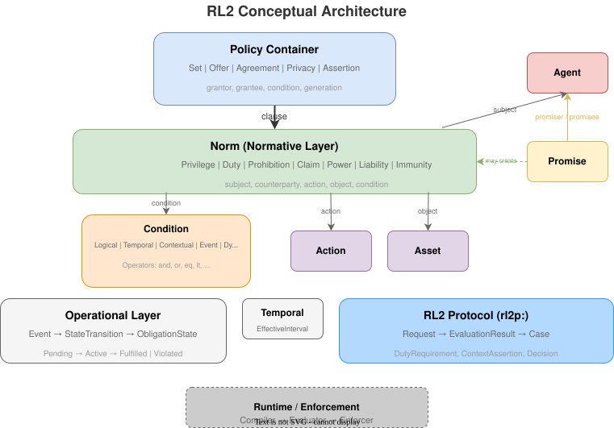

## Introduction

Modern data governance faces a fundamental challenge: bridging the gap between policy intent and machine execution.

Organizations express policies in ODRL 2.2 or natural language, but verifying consistent interpretation and enforcement across systems remains difficult. Several open questions persist in current practice:

- **Temporal semantics:** When does an obligation become active? What constitutes violation?
- **Approval workflows:** How are multi-party approvals modeled within the policy itself?
- **Formal verification:** Can we prove properties about policy behavior before deployment?

**RL2 ("Rights Language 2")** addresses these questions by providing a semantically rigorous policy language with explicit operational semantics and a structure amenable to formal verification.

---

## What is RL2?

RL2 is a unified rights language that combines four complementary foundations:

1. **Normative Logic (DPCL/Hohfeld):** Precise definitions of Privilege, Duty, Power, and Liability based on Hohfeldian legal theory.
2. **Promise Theory:** Modeling voluntary commitments between specific agents, capturing bilateral relationships.
3. **Operational Semantics (ODRE):** Explicit state machines for obligations, defining activation, fulfillment, and violation.
4. **Formal Verification:** A structure designed to be compiled into verifiable logic (Why3, K Framework, Lean 4).

RL2 serves as a **compilation target**. Policies expressed in ODRL or other formats can be translated into RL2, producing deterministic executable specifications.

---

## Illustrative Examples

The following examples demonstrate how RL2 addresses common policy scenarios.

### Temporal Obligations: The "30-Day Deletion" Rule

**Requirement:** "The researcher must delete the data within 30 days of access."

#### ODRL Representation

```turtle
<policy> a odrl:Set ;
    odrl:permission [
        odrl:action odrl:use ;
        odrl:duty [
            odrl:action odrl:delete ;
            odrl:constraint [
                odrl:operator odrl:lte ;
                odrl:rightOperand "P30D"
            ]
        ]
    ] .
```

This representation leaves several questions to the implementer:
- What is the temporal anchor for "P30D"? Policy creation, first access, or approval?
- What is the obligation's current state (pending, active, fulfilled)?
- What constitutes violation, and how should violations be handled?

#### RL2 Representation

RL2 models this as an **Operational Duty** with a clear lifecycle.

```turtle
@prefix rl2:  <https://rl2.example/ontology#> .
@prefix rdfs: <http://www.w3.org/2000/01/rdf-schema#> .
@prefix ex:   <https://example.org/> .
@prefix xsd:  <http://www.w3.org/2001/XMLSchema#> .

# Domain-specific actions (defined by policy/profile)
ex:use a rl2:Action .
ex:delete a rl2:Action .

# Agents and Assets
ex:Researcher a rl2:Agent .
ex:Dataset a rl2:Asset .

ex:policy a rl2:Set ;
    rl2:clause ex:usePrivilege , ex:deleteDuty .

ex:usePrivilege a rl2:Privilege ;
    rl2:subject ex:Researcher ;
    rl2:action ex:use ;
    rl2:object ex:Dataset .

# Profile-declared operands for temporal constraints
ex:clockOperand a rl2:LeftOperand ;
    rdfs:label "System Clock" ;
    rdfs:comment "Current system time from state." ;
    rl2:resolutionPath "state.Clock" .

ex:deadlineOperand a rl2:DynamicOperandReference ;
    rdfs:label "Deletion Deadline" ;
    rdfs:comment "Computed as 30 days after access event timestamp." ;
    rl2:dynamicOperand "state.Events.AccessEvent.timestamp + P30D" .

ex:deleteDuty a rl2:Duty ;
    rl2:subject ex:Researcher ;
    rl2:action ex:delete ;
    rl2:object ex:Dataset ;
    rl2:obligationState rl2:Pending ;
    # Explicit Operational Semantics
    # Deadline: must be fulfilled within 30 days of access
    # Modeled as: current time must be before deadline for duty to remain active
    rl2:condition [
        a rl2:AtomicConstraint ;
        rl2:leftOperand ex:clockOperand ;
        rl2:constraintOperator rl2:lte ;
        rl2:rightOperandRef ex:deadlineOperand
    ] .
```

This representation provides:
- **Explicit temporal anchor:** The deletion deadline is bound to 30 days after the `AccessEvent`.
- **Observable state:** The RL2 runtime tracks when this duty transitions from `Pending` to `Active` to `Fulfilled` or `Violated`.
- **Deterministic evaluation:** If `current_time > deadline` and `delete` has not occurred, the state machine transitions to `Violated`.

---

### Multi-Party Workflows: Approval and Commitment

**Requirement:** "Access requires approval from the Data Owner AND a promise of stewardship from the Researcher."

In many policy languages, multi-party approvals are handled outside the policy itself—the policy grants permission, and application code separately checks for approvals. This creates a gap between policy specification and enforcement.

RL2 models approvals and promises as **normative preconditions** within the policy:

```turtle
@prefix rl2:  <https://rl2.example/ontology#> .
@prefix ex:   <https://example.org/> .
@prefix rdfs: <http://www.w3.org/2000/01/rdf-schema#> .

# Domain-specific action
ex:use a rl2:Action .

# Agents and Assets
ex:Researcher a rl2:Agent .
ex:DataOwner a rl2:Agent .
ex:Dataset a rl2:Asset .

# Custom promise content
ex:DataStewardship rdfs:label "Data Stewardship Commitment" .

ex:usePrivilege a rl2:Privilege ;
    rl2:subject ex:Researcher ;
    rl2:action ex:use ;
    rl2:object ex:Dataset ;
    rl2:condition [
        a rl2:LogicalConstraint ;
        rl2:constraintOperator rl2:and ;
        rl2:operand ex:OwnerApproval ;
        rl2:operand ex:StewardshipPromiseCheck
    ] .

ex:OwnerApproval a rl2:EventConstraint ;
    rl2:expectsEvent [
        a rl2:Event ;
        rl2:approver ex:DataOwner
    ] .

ex:StewardshipPromiseCheck a rl2:Condition ;
    rl2:requires ex:StewardshipPromise .

ex:StewardshipPromise a rl2:Promise ;
    rl2:promisor ex:Researcher ;
    rl2:promisee ex:DataOwner ;
    rl2:promiseContent ex:DataStewardship ;
    rl2:promiseState rl2:PromiseFulfilled .
```

The policy is self-contained: the `Privilege` evaluates to active only when the required `Event` (approval) and `Promise` exist in the system state. The enforcement logic is specified within the policy, not in application code.

---

### Dynamic Workflows: Conditional Policy Activation

**Requirement:** "The committee can choose to review or decline. If they accept, the requester must obtain full approval."

Some workflows require different policies to apply depending on events that occur during execution. Rather than modeling this as branching within a single policy, RL2 uses **policy-level activation conditions**—separate policies that become applicable when their preconditions are met:

```turtle
@prefix rl2:  <https://rl2.example/ontology#> .
@prefix ex:   <https://example.org/> .

# Domain-specific actions and events
ex:submitForReview a rl2:Action .
ex:obtainFullApproval a rl2:Action .
ex:CommitteeAcceptance a rl2:Event .

# Policy 1: Initial review request (always applicable)
ex:reviewRequestPolicy a rl2:Set ;
    rl2:clause ex:askCommitteeDuty .

ex:askCommitteeDuty a rl2:Duty ;
    rl2:subject ex:Requester ;
    rl2:action ex:submitForReview ;
    rl2:object ex:Case .

# Policy 2: Full review (applicable only when committee accepts)
ex:fullReviewPolicy a rl2:Set ;
    rl2:condition [
        a rl2:EventConstraint ;
        rl2:expectsEvent [ a ex:CommitteeAcceptance ]
    ] ;
    rl2:clause ex:obtainApprovalDuty .

ex:obtainApprovalDuty a rl2:Duty ;
    rl2:subject ex:Requester ;
    rl2:action ex:obtainFullApproval ;
    rl2:object ex:Case .
```

The workflow behavior:
- **Committee declines:** Only `reviewRequestPolicy` ever applied. Case concludes.
- **Committee accepts:** `CommitteeAcceptance` event enters state Σ → `fullReviewPolicy` becomes applicable → new duty activates.

Events change which policies apply, rather than branching within a single policy. The RL2 evaluator re-assesses applicable policies on each context change, making dynamic workflows a natural consequence of the architecture.

---

## Why Promises Are Not Norms

RL2 distinguishes between **Norms** (Hohfeldian deontic positions) and **Promises** (voluntary commitments). This distinction is fundamental to the RL2 architecture and warrants explanation.

### The Conceptual Difference

| Aspect | Norm | Promise |
|--------|------|---------|
| **Source** | Imposed by policy, law, or authority | Voluntary commitment by an agent |
| **Nature** | Deontic position: what one *must*, *may*, or *may not* do | Cooperative undertaking: what one *will* do |
| **Creation** | Policy author defines; subject may not consent | Promiser actively makes the commitment |
| **Parties** | Subject bears the burden; counterparty may be abstract | Promiser commits *to* a specific promisee |

### Why This Matters

Consider two statements:

1. **"Alice must delete the data within 30 days"** — This is a **Duty**. It is imposed by policy. Alice may not have agreed to it; it applies because she accessed the data under a policy that includes this requirement.

2. **"Alice commits to Bob that she will handle data responsibly"** — This is a **Promise**. Alice voluntarily made this commitment to Bob. It exists because Alice chose to make it, not because a policy imposed it.

### Promises May Create Norms

The relationship between promises and norms is generative: a promise can *give rise to* normative positions.

When Alice promises Bob she will delete the data, this promise may create:
- A **Duty** on Alice (to perform the deletion)
- A **Claim** for Bob (to have the data deleted)

But the promise itself is not the duty—it is the *source* of the duty. This distinction matters for:

- **Provenance**: We can trace *why* a duty exists (imposed by policy vs. arising from voluntary commitment)
- **Enforcement**: Promises require both parties to be identified; duties may have abstract counterparties
- **Lifecycle**: Promises have their own states (pending, fulfilled, violated) independent of the duties they create

### In the RL2 Model

RL2 models this as:
- `rl2:Promise` connects agents via `promisor` and `promisee`
- `rl2:Duty` (and other norms) are separate classes that may be created as a consequence
- A condition can check whether a promise exists (`rl2:requires ex:StewardshipPromise`)
- The promise's state is tracked independently (`rl2:promiseState`)

This separation enables policies that reason about both imposed obligations *and* voluntary commitments within a unified framework.

---

## Conceptual Model



The diagram illustrates how RL2's core concepts relate:

- **Policy Container** holds clauses (norms) and may specify grantor, grantee, and conditions
- **Norms** (Privilege, Duty, Prohibition, etc.) form the normative layer, connecting subjects to actions and objects
- **Promise** is modeled separately—agents make promises to each other, which may create norms
- **Conditions** constrain when norms apply (logical, temporal, contextual, event-based, or dynamic)
- The **Operational Layer** tracks obligation lifecycle (Pending → Active → Fulfilled/Violated)
- The **RL2 Protocol** defines the request/response interface for policy evaluation

---

## Architecture Overview

RL2 integrates into existing systems through three components:

**Compiler**
- Input: ODRL 2.2 or native RL2 policies.
- Process: Translates ODRL into RL2 structures, reporting any semantic gaps that require explicit choices (e.g., "Duty missing temporal anchor—please specify").
- Output: A validated RL2 graph.

**Evaluator (Kernel)**
- A small, side-effect-free decision function (suitable for implementation in Rust, OCaml, or verified languages).
- Input: RL2 graph + event log + current state.
- Output: `Permit` / `Deny` / `Violations` / `Pending obligations`.

**Enforcer**
- The API gateway or data platform that queries the evaluator and acts on decisions.

### Profile-Declared Operands

A key architectural principle in RL2 is the separation between the **policy calculus** (norms, conditions, operators) and the **observation model** (what contextual data can be accessed).

RL2 Core defines the mechanism for conditions but does not define domain-specific operands like `purpose`, `dataOwner`, or `jurisdiction`. These are provided by **profiles**—domain-specific extensions that declare operands with explicit resolution semantics:

```turtle
@prefix privacy: <https://rl2.example/profile/privacy#> .

privacy:purposeOperand a rl2:LeftOperand ;
    rl2:resolutionPath "context.purpose" ;
    rdfs:range privacy:Purpose .

privacy:dataOwnerOperand a rl2:LeftOperand ;
    rl2:resolutionPath "asset.dataOwner" ;
    rdfs:range rl2:Agent .
```

This architecture provides:

- **No ontology drift:** RL2 Core remains stable; profiles own domain semantics
- **Formal grounding:** All data access maps to the `resolve`/`deref` functions in the semantics
- **Type safety:** Operands declare expected ranges, enabling validation
- **Enterprise adaptability:** Different profiles for privacy (GDPR), media licensing, financial services, etc.
- **Mechanization:** Clean mapping to verification targets (Why3, Lean)

Conceptually, RL2 follows the same pattern as TLA+ (state variables), Rego (input.*), and Datalog (EDB predicates)—separating the policy logic from the observation interface.

---

## Scope and Positioning

RL2 is a **semantically well-specified policy language**. Its primary contribution is providing unambiguous meaning for policy expressions—not replacing existing systems, but complementing them with a rigorous semantic foundation.

The RL2 Protocol (RL2P) defines an evaluation interface, enabling RL2 to serve as both a specification language and an executable policy format. However, RL2's value lies primarily in semantic precision: policies authored in RL2 have clear, verifiable meaning regardless of where or how they are enforced.

### Complementing ODRL

RL2 is a semantic superset of ODRL 2.2 and covers all identified ODRL 3.0 use cases. Every ODRL construct has a direct RL2 equivalent, and the translation is semantics-preserving. See **RL2_ODRL_Coverage.md** for the complete mapping.

RL2 complements ODRL by providing:

- **Hohfeldian normative precision**: Distinguishing Privilege, Duty, Claim, Power, Liability, and Immunity where ODRL uses broader categories
- **Promise Theory integration**: Modeling voluntary bilateral commitments as a distinct concept from imposed obligations
- **Operational semantics**: Explicit obligation lifecycle (Pending → Active → Fulfilled/Violated) with deterministic state transitions, drawing on the ODRE framework
- **Policy-level activation conditions**: Enabling dynamic policy applicability based on events

These extensions address known ODRL limitations—including informal semantics and lack of enforcement specification—systematically catalogued in recent research [ODRL Limitations 2025].

ODRL policies can be compiled to RL2 for formal analysis, then deployed via ODRL-compatible systems or native RL2 evaluation.

### Complementing Data Contract Standards

The emerging data mesh paradigm requires **data contracts**—formal agreements between data producers and consumers specifying schemas, quality guarantees, and usage terms. Current efforts include:

- **OMG Data Product Ontology (DPROD)**: A 2024 specification extending DCAT for data product metadata, which references ODRL for usage policies
- **Open Data Contract Standard (ODCS)**: A YAML-based schema for data contracts with quality rules
- **Open Data Product Specification (ODPS)**: Metadata standard with recent data contract support

These specifications focus on *metadata* and *schema*—they describe what data products look like and reference external policy languages for usage terms. RL2 can serve as that policy language:

- **Usage terms** expressed as RL2 Privileges, Duties, and Prohibitions
- **Quality commitments** modeled as Promises from producer to consumer
- **Access conditions** specified via RL2's condition framework (temporal, contextual, event-based)
- **Violation semantics** defined through the operational layer

RL2 does not replace these standards; it provides semantic depth for the policy components they reference.

*Investigation ongoing: A formal alignment between RL2 and DPROD/ODCS is under development.*

### Complementing Authorization Engines

Modern authorization systems include Cedar (AWS), OPA/Rego (CNCF), XACML (OASIS), and proprietary solutions. These are optimized for **runtime access control decisions**—determining whether a principal can perform an action on a resource, evaluated in milliseconds.

RL2 occupies a different niche: **policy specification and verification**. The relationship is complementary:

| Concern | Authorization Engines | RL2 |
|---------|----------------------|-----|
| **Primary goal** | Fast runtime decisions | Semantic precision and verification |
| **Optimization** | Evaluation speed (μs–ms) | Formal properties, auditability |
| **Obligation handling** | Limited or external | Native lifecycle tracking |
| **Temporal semantics** | Typically external | Built-in deadlines, intervals, sequences |
| **Normative distinctions** | Permission/deny | Full Hohfeldian framework |

A typical integration pattern:

1. Policies are authored and verified in RL2
2. Static access rules compile to Cedar, OPA, or XACML for runtime enforcement
3. Dynamic obligations and temporal constraints are tracked via RL2P or integrated systems
4. RL2 semantics serve as the source of truth for audit, compliance, and dispute resolution

RL2 does not aim to replace Cedar's speed or OPA's expressiveness. Rather, it provides a semantic layer where policies can be formally specified, verified, and translated to appropriate enforcement mechanisms.

*Investigation ongoing: Compilation targets for Cedar and OPA are under research.*

### Building on ODRE and Usage Control Research

RL2's operational layer draws on research into enforceable digital rights, particularly the ODRE (Open Digital Rights Enforcement) framework and the UCON_ABC usage control model [UCON_ABC]. Key influences include:

- **Obligation lifecycle**: The Pending → Active → Fulfilled/Violated state machine, enabling runtime tracking of duty satisfaction. UCON introduced continuity (ongoing controls) and mutability concepts; RL2 formalizes these through explicit state transitions and the Power normative concept.
- **Synchronous and asynchronous enforcement**: Policies can be evaluated on-demand (access request) or continuously (monitoring)
- **Event-triggered transitions**: State changes driven by observable events

RL2 extends ODRE by integrating operational semantics with Hohfeldian normative theory and Promise Theory, providing a unified framework for both descriptive and enforceable policies.

---

## Motivation and Applications

As automated systems—including AI agents—take on compliance and enforcement tasks, they require policies with unambiguous semantics. A policy language with formal operational semantics enables:

- **Automated reasoning:** Agents can evaluate whether actions satisfy constraints without human interpretation.
- **Audit trails:** The state machine produces a verifiable record of obligation states and transitions.
- **Formal verification:** Policy properties can be proven before deployment using standard verification tools.

RL2 bridges high-level legal intent and machine execution by making policy semantics explicit and deterministic.

---

## References

See **RL2_References.md** for complete citations and glossary.

**RL2 Specifications:**
- RL2_Core.md — Core ontology
- RL2_Semantics.md — Formal semantics
- RL2_Protocol.md — Evaluation protocol
- RL2_ODRL_Coverage.md — ODRL compatibility
- RL2_ResearchPlan.md — Mechanization roadmap (Why3, K, Lean 4)